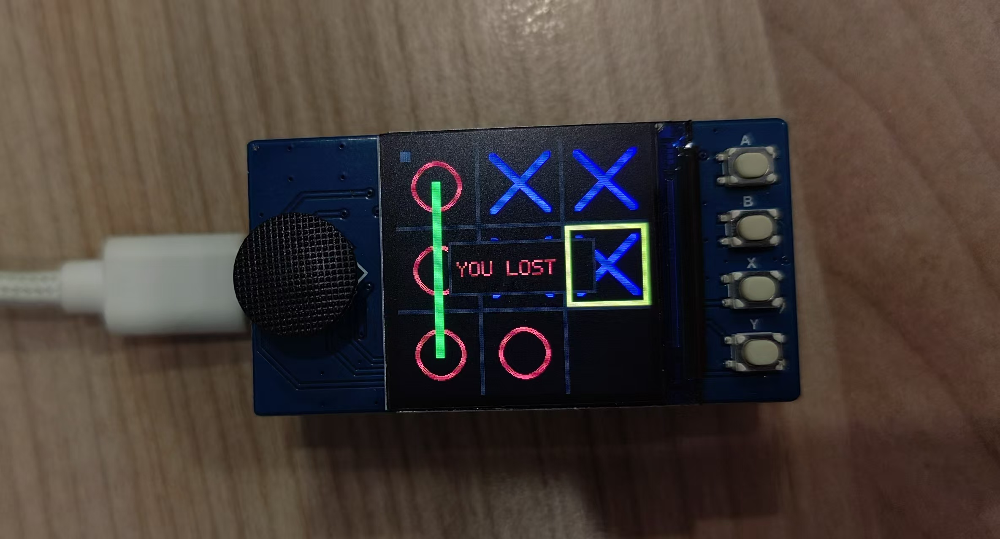
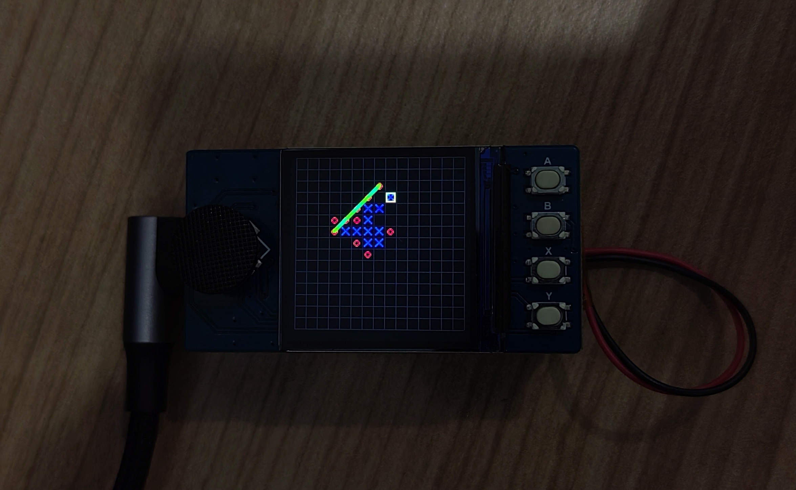

# PicoBoard-Games

A classic game collection for **Raspberry Pi Pico (RP2040)** with a 1.3" ST7789 LCD and 5-way joystick: **Tic-Tac-Toe** and **Gomoku** (Five in a Row). Play against the board or against an AI on a minimal embedded setup.

## Screenshots

| Tic-Tac-Toe | Gomoku |
|-------------|--------|
|  |  |

## Features

- **Tic-Tac-Toe** — Two players or simple AI
- **Gomoku (五子棋)** — Human vs AI with pattern-based engine (Minimax + Alpha-Beta + heuristic evaluation)
- **Menu** — Choose game from the main screen
- **240×240** display, joystick + buttons for input

## Hardware

- **MCU:** Raspberry Pi Pico (RP2040)
- **Display:** 1.3" ST7789 LCD (240×240)
- **Input:** 5-way joystick + action buttons (e.g. A, B, X, Y)

Pin definitions are in `src/drivers/hw/BoardPins.h` (and `lib/Config/BoardPins.h`). Adjust for your wiring if needed.

## Project Structure

```
├── CMakeLists.txt          # Top-level build
├── pico_sdk_import.cmake    # Pico SDK path
├── src/
│   ├── app/                 # Entry: app_main.c
│   ├── core/                # Input (buttons), render (framebuffer, shapes)
│   ├── drivers/             # HW config, LCD (ST7789)
│   │   ├── hw/              # DEV_Config, BoardPins
│   │   └── lcd/             # LCD_1in3
│   ├── game/                # Game logic
│   │   ├── tictactoe_game.* # Tic-Tac-Toe rules
│   │   └── gomoku_game.*     # Gomoku rules + AI
│   └── ui/                  # Menus and game screens
│       ├── menu_ui.*        # Main menu
│       ├── tictactoe_ui.*   # Tic-Tac-Toe screen
│       └── gomoku_ui.*      # Gomoku screen
└── lib/                     # Optional legacy driver copies (Config, LCD)
```

## Build

1. Install [Pico SDK](https://github.com/raspberrypi/pico-sdk) and set `PICO_SDK_PATH`.
2. From the project root:

   ```bash
   mkdir build && cd build
   cmake ..
   ninja
   ```

3. Copy `main.uf2` to the Pico (USB mass storage).

## Controls (typical)

| Action        | Input              |
|---------------|--------------------|
| Menu / Move   | Joystick (Up/Down/Left/Right) |
| Confirm       | A, Y, or joystick press |
| Back / Quit   | X                  |
| Restart game  | B                  |

## Gomoku AI

The engine uses **Minimax with Alpha-Beta pruning** and a **pattern-based heuristic** (five, live-four, block-four, live-three, etc.). Search depth is 3 for responsive play on the Pico. It includes must-win and must-block checks before search. No MCTS or neural networks.

## License

See [LICENSE](LICENSE).
