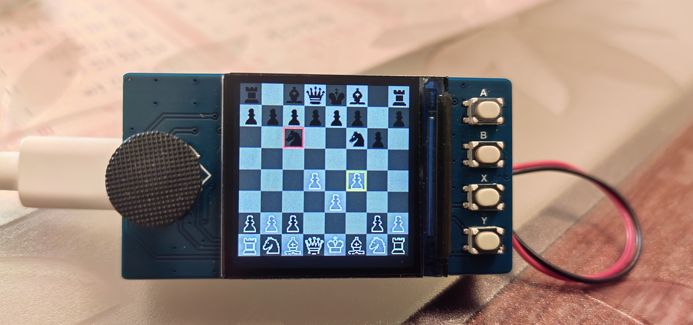
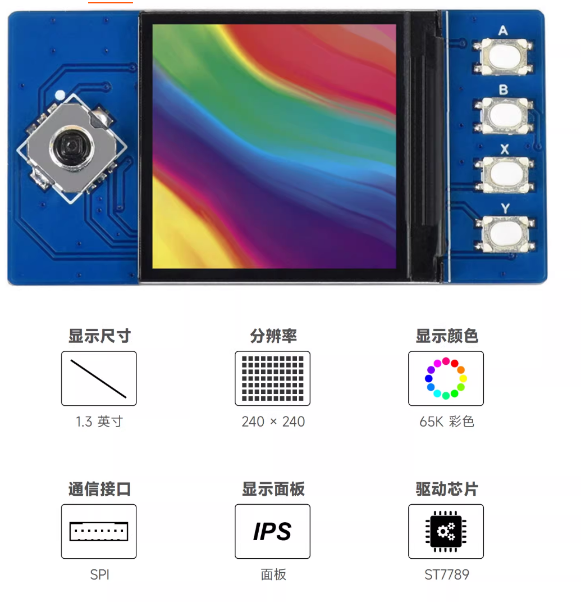
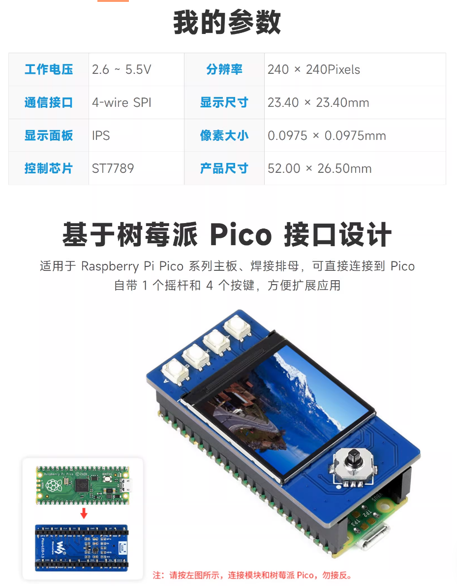
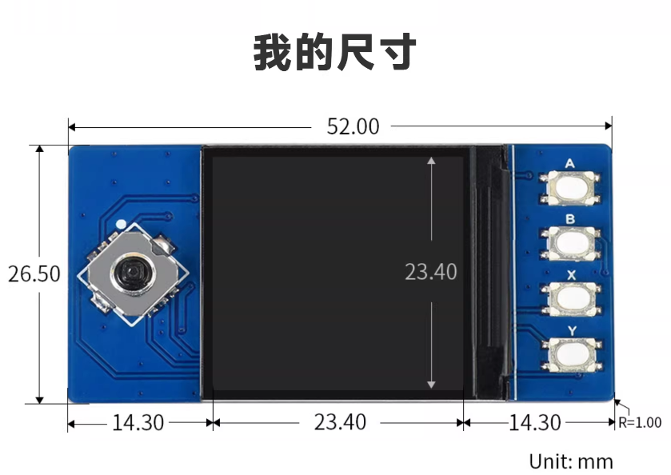
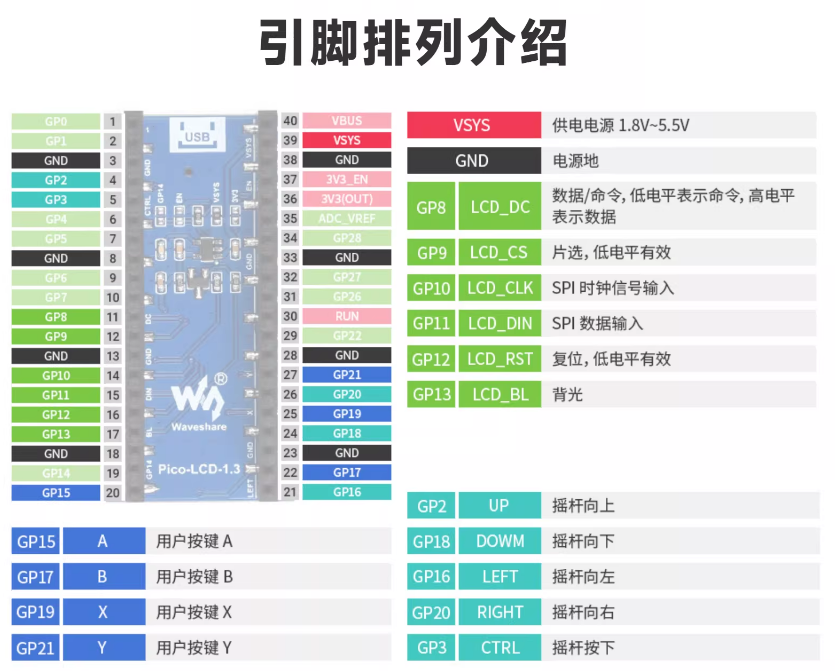

# PicoBoard-Games

基于 **树莓派 Pico (RP2040)** + 1.3 寸 ST7789 屏幕与五向摇杆的经典游戏合集：**井字棋**、**五子棋**与**国际象棋**。支持人机对战，适合在嵌入式小板上游玩。
[English](README.md) | 中文
## 截图

| 井字棋 | 五子棋 | 国际象棋 |
|--------|--------|----------|
|  |  |  |

## 功能特点

- **井字棋** — 人机对战
- **五子棋** — 人机对战，采用棋型启发式引擎（Minimax + Alpha-Beta + 启发式评估）
- **国际象棋** — 人类执白、AI 执黑；难度 Easy（贪心评估）与 Medium（3 层 Negamax + Alpha-Beta）；升变仅升后；选中子黄框、AI 上步红框
- **主菜单** — 从主界面选择游戏
- **240×240** 显示，摇杆 + 按键操作

## 硬件

- **MCU：** 树莓派 Pico (RP2040)
- **屏幕：** 1.3 寸 ST7789 LCD（240×240，65K 色）
- **输入：** 五向摇杆 + 动作键（如 A、B、X、Y）

**所用开发板：** [微雪 (Waveshare)](https://www.waveshare.com/) — 树莓派 Pico 1.3 寸显示屏 65K 彩色 LCD 扩展板模块，板载 ST7789。淘宝购买链接：[商品链接](https://item.taobao.com/item.htm?id=642902148099)。

| 开发板概览 | 开发板详细信息（引脚等） |
|------------|--------------------------|
|  |  |
| **外观与尺寸** | **引脚排列** |
|  |  |

引脚在 `src/drivers/hw/BoardPins.h`（以及 `lib/Config/BoardPins.h`）中定义，接线不同时请自行修改。

## 项目结构

```
├── CMakeLists.txt          # 顶层构建
├── pico_sdk_import.cmake    # Pico SDK 路径
├── src/
│   ├── app/                 # 入口：app_main.c
│   ├── core/                # 输入（按键）、渲染（帧缓冲、图形）
│   ├── drivers/             # 硬件配置、LCD (ST7789)
│   │   ├── hw/              # DEV_Config、BoardPins
│   │   └── lcd/             # LCD_1in3
│   ├── game/                # 游戏逻辑
│   │   ├── tictactoe_game.* # 井字棋规则
│   │   ├── gomoku_game.*    # 五子棋规则 + AI
│   │   └── chess_*          # 国际象棋规则、走法、评估与 Easy/Medium AI
│   └── ui/                  # 菜单与游戏界面
│       ├── menu_ui.*        # 主菜单
│       ├── tictactoe_ui.*   # 井字棋界面
│       ├── gomoku_ui.*      # 五子棋界面
│       └── chess_ui.*       # 国际象棋：难度选择 + 棋盘/棋子/输入
└── lib/                     # 可选旧版驱动副本 (Config, LCD)
```

## 编译

1. 安装 [Pico SDK](https://github.com/raspberrypi/pico-sdk) 并设置 `PICO_SDK_PATH`。
2. 在项目根目录执行：

   ```bash
   mkdir build && cd build
   cmake ..
   ninja
   ```

3. 将生成的 `main.uf2` 复制到 Pico（USB 大容量存储模式）。

## 操作说明（示例）

| 操作         | 按键/摇杆           |
|--------------|---------------------|
| 菜单/移动    | 摇杆 上/下/左/右     |
| 确认         | A、Y 或摇杆按下     |
| 返回/退出    | X                   |
| 重新开始     | B                   |

**国际象棋：** 同上。选中己方子（黄框）后移动到合法格并确认走子；**再次按同一格可取消选中**。底部显示「AI Thinking...」；AI 上一步走子用红框标出。进入游戏前先选 **Easy** 或 **Medium** 难度。

## 国际象棋 AI

棋规与 AI 从 [Chess_Pico](demo/Chess_Pico) 演示（C++ → C）移植。**Easy** 为贪心子力评估；**Medium** 为 3 层 Negamax + Alpha-Beta，使用 `eval_material` / `eval_after_move`。升变仅升后。人类执白，AI 执黑。棋子为 28×28 1bpp，由 `tools/chess_piece_scale/scale_pieces.py` 从 demo 资源生成。

## 五子棋 AI

引擎采用 **Minimax + Alpha-Beta 剪枝**，配合**棋型启发式评估**（五连、活四、冲四、活三等）。搜索深度为 3，在 Pico 上保证响应速度；包含必杀、必防判断后再进行搜索。未使用 MCTS 或神经网络。

## 许可证

见 [LICENSE](LICENSE)。
